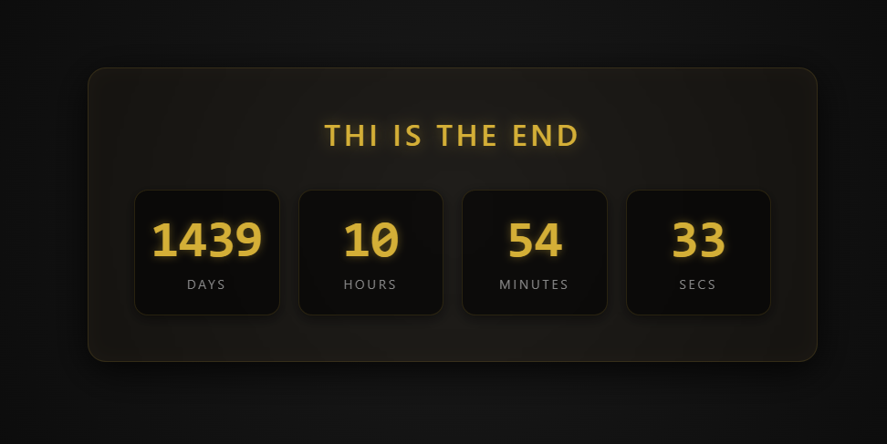

# Countdown Web

A simple, lightweight, web-based countdown timer. 

Synchronizes with a target date set on the server. This ensures that every visitor viewing the page sees the exact same remaining time, regardless of their local time zone or device settings.

## Features

- **Server-Synchronized:** Guarantees all visitors see the same countdown.
- **Lightweight & Fast:** Simple web interface with minimal overhead.
- **Real-Time Updates:** Seamlessly ticks down to the target event.

## Screenshot

## Configiuration

Just change whatever you want in the begining of the code.
